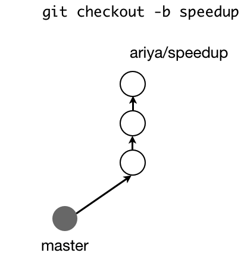

# GIT Commands

Here you will find a list of useful git commands.

1. [Tell Git who you are](#Who)
2. [Create a new local repository](#Create)
3. [Check out a repository](#Checkout)
4. [Add/Reset files to Stage (to commits)](#Add)
5. [Stash](#Stash)
6. [Commit](#Commit)
7. [Push](#Push)
8. [Status](#Status)
9. [Connect to a remote repository](#Remote)
10. [Branches](#Branches)
11. [Update from the remote repository](#Update)
12. [Branches](#Branches)
13. [Tags](#Tags)
14. [Undo](#Undo)
15. [Search](#Search)
16. [Rebases](#Rebases)
17. [Merges](#Merges)
18. [Ignore](#Ignore)


### <a name="Who">Tell Git who you are</a>

Configure the author name and email address to be used with your commits.

```
git config --global user.name "Sam Smith"
git config --global user.email sam@example.com
``` 

### <a name="Create">Create a new local repository</a>

Initialize a directory as git project.

```
git init
```

### <a name="Checkout">Check out a repository</a>

Create a working copy of a local repository:

```
git clone /path/to/repository
```

For a remote server, use:

```
git clone <url>
```

### <a name="Add">Add/Reset files to Stage (to commits)</a>

Add one or more files to staging (index):

```
git add <filename>  # Add one file
git add .  			# Add all files
```

To reset these files from stage:

```
git reset <filename> 	# Reset one files
git reset				# Reset all files
```

### <a name="Stash">Stash</a>

Sometimes, we will want to pull changes or work through differents branches, but we have changes that we want to preservate.
So that, we can do an stash, in orther to generate a wip:

```
git stash
```

If we want to restore our changes in the last wip, we just have to do:

```
git stash pop
```

### <a name="Commit">Commit</a>

Commit changes to head (but not yet to the remote repository):

```
git commit -m "Commit message"
```

Commit any files you've added with git add, and also commit any files you've changed since then:

```
git commit -a
```

### <a name="Push">Push</a>

Send changes to the master branch of your remote repository:

```
git push origin master
```

### <a name="Status">Status</a>

List the files you've changed and those you still need to add or commit:

```
git status
```

### <a name="Remote">Connect to a remote repository</a>

If you haven't connected your local repository to a remote server, add the server to be able to push to it:

```
git remote add origin <server>
```

List all currently configured remote repositories:

```
git remote -v
```

### <a name="Branches">Branches</a>

Create a new branch and switch to it:

```
git checkout -b <branchname>
```

Switch from one branch to another:	

```
git checkout <branchname>
```

List all the branches in your repo, and also tell you what branch you're currently in:	

```
git branch
```

Delete the feature branch:	

```
git branch -d <branchname>
```

Push the branch to your remote repository, so others can use it:	

```
git push origin <branchname>
```

Push all branches to your remote repository:	

```
git push --all origin
```

Delete a branch on your remote repository:	

```
git push origin :<branchname>
```


### <a name="Update">Update from the remote repository</a>

Fetch and merge changes on the remote server to your working directory:	

```
git pull
```

To merge a different branch into your active branch:	

```
git merge <branchname>
```

View all the merge conflicts:

```
git diff
```

View the conflicts against the base file:

```
git diff --base <filename>
```

Preview changes, before merging:

```
git diff <sourcebranch> <targetbranch>
```

After you have manually resolved any conflicts, you mark the changed file:	

```
git add <filename>
```

### <a name="Tags">Tags</a>

You can use tagging to mark a significant changeset, such as a release:	

```
git tag 1.0.0 <commitID>
```

CommitId is the leading characters of the changeset ID, up to 10, but must be unique. Get the ID using:	

```
git log
```

Push all tags to remote repository:	

```
git push --tags origin
```

### <a name="Undo">Undo local changes</a>

If you mess up, you can replace the changes in your working tree with the last content in head:
Changes already added to the index, as well as new files, will be kept.

```
git checkout -- <filename>
```

Instead, to drop all your local changes and commits, fetch the latest history from the server and point your local master branch at it, do this:	

```
git fetch origin
git reset --hard origin/master
```

### <a name="Search">Search</a>

Search the working directory for foo():	

```
git grep "foo()"
```

### <a name="Rebases">Rebases</a>

Rebase is like a merge but without diamond shape. That means that we will allocate our commits above commits from the other branch.

If you want to do a rebase, first, you have to be in the local branch which will receive the changes.

```
git branch master
git rebase bugfix
```

Also we can decide what commits will rebase, squash them and other options. For that, we can do an interactive rebase:

```
git rebase -i bugfix
```

This will open an interactive screen so as to decide the commits to rebase.

### <a name="Merges">Merges</a>

If you want to do a merge, first, you have to be in the local branch which will receive the changes. Imagine you want to merge the branch **bugfixs** to **master**. First you have to check out to master, and then apply the merge:

```
git checkout master
git merge bugfix
```

#### Fast-Forward

Merging a branch is a pretty common operation when using Git.
In some circumstances, Git by default will try to merge a branch in a fast-forward mode.
How is this different with a merge without fast-forwarding?

<p align="center">
    
</p>

Let us assume that I created a topic branch named speedup from the current master.
After working on this branch for a while (three commits, those white circles),
I finally decided that I am done and then I pushed it to my own remote. Meanwhile,
nothing else happened in the master branch, it remained in the same state right before I branched off.
The situation is depicted in the following diagram.

Once the project maintainer got notified that my branch is ready to be integrated,
she might use the usual steps of git fetch followed by git merge and thus,
my work is landed in the source tree. Because master has not been changed since the commit
(gray circle) which serves as the base for the said topic branch, Git will perform the merge using fast-forward.
The whole series of the commits will be linear. The history will look like the diagram below (left side).

<p align="center">
    
</p>
Another variant of the merge is to use -no-ff option (it stands for no fast-forward).
In this case, the history looks slightly different (right side),
there is an additional commit (dotted circle) emphasizing the merge.
This commit even has the right message informing us about the merged branch.

The default behavior of Git is to use fast-forwarding whenever possible.
This can be changed, the no fast-forward mode can be easily set as the default merge
using the right proper configuration.

### <a name="Ignore">File .gitignore</a>

This file configure all files you don't want to stage in a commit. You have to create this file at the same level than the **.git** folder. The format for this file is like this:


```
.gitignore
static/
media/
db.sqlite3
```

All this files and folder won't be staged when you execute a ```git add``` command.

</br>

Version: **1.0**

Author: **Andres Rojano**
